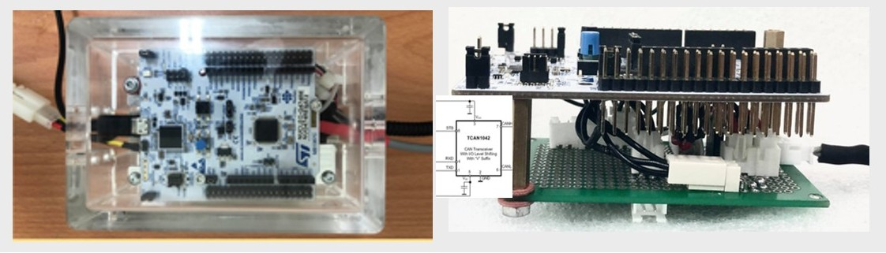
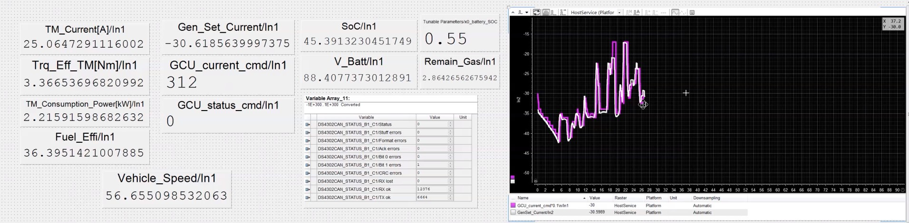
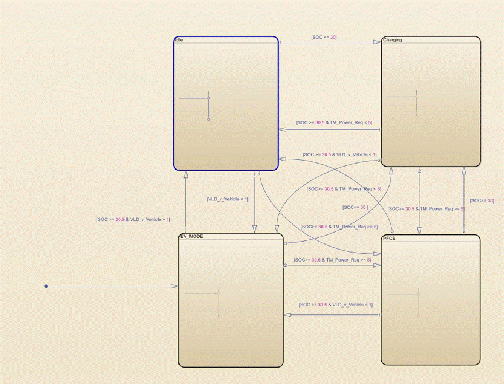
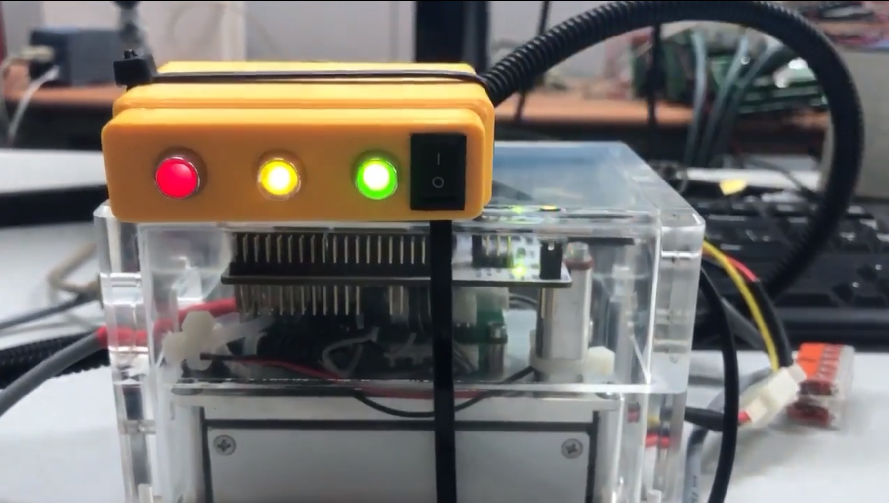

# Embedded SW/SYS engineer  
  
*Hi I'm Kevin Lee, former Sr. Firmware Engineer at Delta Electronics with 4+ years of automotive electronics experience. Currently pursuing an M.S. in Embedded & Cyber-Physical Systems at UC Irvine. I'm passionate about creating reliable embedded software, system—and living a curious life connected to nature and people.*

[🗂️ My resume.](resume.md)  

**M.S. Embedded & Cyber-Physical Systems Graduate Student**, UC Irvine
**M.S. Mechanical Engineering, National Taiwan University**  

---
## 🤝Let's Connect 
[LinkedIn](https://www.linkedin.com/in/kevin-lee-253645167) | [GitHub](https://github.com/kevin-chengchihlee) | [✉️kevin.chengchihlee@gmail.com](mailto:kevin.chengchihlee@gmail.com) | Irvine, CA  

---

## 🚀Projects
---
- ## Range-Extended Hybrid Powertrain for MotorBike:  
**Energy Management Strategy development and VCU prototyping.** 
*NTU Advanced Power R&D Center*   
C|SIMULINK|STM32|CANBUS|dSPACE| 
Real-Time System|Automotive   
  [⚙️Check for more detail](proj_vcu_ems.md)   
  In this project, a hybrid-powertrain was proposed with the prototype made. I was responsible for the Energy-Management-Strategy design and development on a VCU prototype.  
The VCU Prototype with energy-management-strategy embedded SW and CANBUS.

 CiL test with dSpace through drive cycle and vehicle model.

Software StateChart & VCU in operation.   

---
- ## X-by-Wire Control EV Truck Platform:  
**Fully by-wire controled EV truck platform development and HiL V&V platform development.** 
*NTU Advanced Power R&D Center*   
EV|C|SIMULINK|STM32|CANBUS|dSPACE| 
Real-Time System|Automotive|HiL|   
  In this project, an X-by-Wire controlled BEV truck platform and a corresponding Hardware-in-the-Loop (HiL) subsystem platform were proposed and developed. By performing detailed modeling and simulation of the vehicle and its subsystems, the architecture and specifications for both the truck and the HiL platform were defined. All subsystems were then developed and integrated into a closed-loop HiL environment using dSPACE for real-time vehicle dynamics and environment simulation. Finally, the subsystems were deployed on the target vehicle and successfully validated through a proof-of-concept (PoC) test run.     
  The top-view of the developed vehicle. There's no cockpit since it's fully by-wire/remote controlled.

  One test run of the vehicle. The big box at the front contains all subsystem controllers.

---
- ## LightSwarm Network:  
**IoT self-organizing network.**   
C|Python|ESP32|RaspberryPi|UDP|FreeRTOS|Real-Time Sys   
  [🗂️Repository](https://github.com/kevin-chengchihlee/LightSwarm)   
  [⚙️Check for more detail](proj_lightswarm.md)   
  In this project, a self-organizing LightSwarm is developped with communication through UDP. Multiple ESP32s are the swarm device and a RaspberryPi 5 as a master device for monitoring.   
  The system flow-chart of the swarm network.
  

---
- ## Infineon Aurix EV Traction Inverter Embedded SW:  
*Delta Electronics Inc.*   
C|Python|InfineonAurix|dSPACE|ASPICE|HiL| 
Jenkins|VectorCAST|MISRA C   
  Development of the Embedded SW of an EV Traction Inverter, including CPU load analysis and optimization. During this project, the automated verification pipeline was also established for saving ~85% labor per SW release.

---
- ## p5v04a Camera Img Shot with RaspberryPi 5:  
Python|Raspberry Pi 5|Camera|   
  [🗂️Repository](https://github.com/kevin-chengchihlee/p5v04a_camera_easyshot)   
  [⚙️Check for more detail](proj_camera_p5v04a.md)   
  This is a small part of a group project. I'm responsible for developing the camera APIs for further integration.
  In the repository, the scripts would run an easy image taking application. With input "s" or "q" for taking shots and quitting. The images would be stored in the same directory. 
    

---